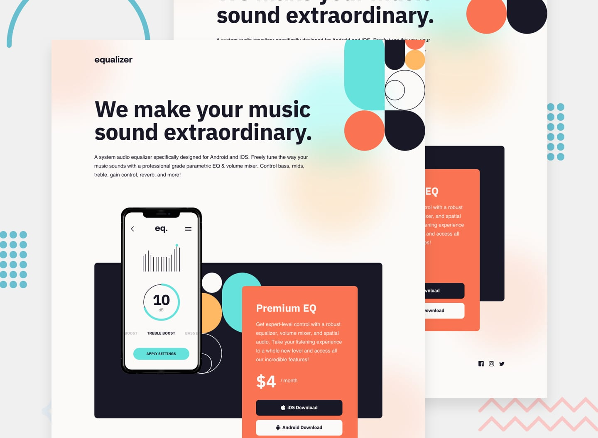

# Frontend Mentor - Equalizer landing page solution - (figma to code)
(figma to code)
Designed by [Frontend Mentor](https://www.frontendmentor.io/challenges/meet-landing-page-rbTDS6OUR) and coded by [Gümrah Sindar](https://www.linkedin.com/in/gumrahsindar/)

## Table of contents

- [Overview](#overview)
  - [The challenge](#the-challenge)
  - [Screenshot](#screenshot)
  - [Links](#links)
- [My process](#my-process)
  - [Built with](#built-with)
  - [What I learned](#what-i-learned)
- [Author](#author)

## Overview

### The challenge

Users should be able to:

- View the optimal layout depending on their device's screen size
- See hover states for interactive elements

### Screenshot

### Links

- Live Site URL: [Vercel](https://equalizer-landing-page-eta.vercel.app/)

## My process

### Built with

- Semantic HTML5 markup
- CSS custom properties
- Flexbox
- Mobile-first workflow
- [React](https://reactjs.org/) - JS library
- [Next.js](https://nextjs.org/) - React framework
- [Tailwind CSS](https://tailwindcss.com/) - For styles
- [Shadcn/ui](https://ui.shadcn.com/) - Component library

### What I learned

In this project I experienced Shadcn for the first time. It is a component library for React and Next.js. It is very easy to use and has a lot of components. I liked it very much and I will use it in my future projects.

## Author

- LinkedIn - [Gümrah Sindar](https://www.linkedin.com/in/gumrahsindar/)
- Frontend Mentor - [@gumrahsindar](https://www.frontendmentor.io/profile/gumrahsindar)
- Twitter - [@gmrhsndr](https://twitter.com/gmrhsndr)
